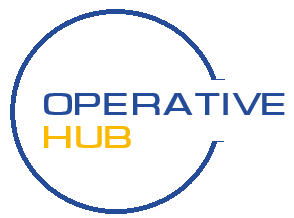

<!-- Improved compatibility of back to top link: See: https://github.com/othneildrew/Best-README-Template/pull/73 -->

<a name="readme-top"></a>

<!-- PROJECT LOGO -->
<br />
<div align="center">
  <a href="https://github.com/PatrykO92/operative_hub">
    
  </a>

<h3 align="center">Operative-Hub</h3>
  <p align="center">
    Optimizes truck management, enhances loading efficiency, and supports maintenance schedules and production issue tracking.
    <br />
    <br />
    <a href="https://lzr-operative-hub.vercel.app/">View Demo</a>
    ·
    <a href="https://github.com/PatrykO92/operative_hub/issues/new?labels=bug&template=bug-report---.md">Report Bug</a>
    ·
    <a href="https://github.com/PatrykO92/operative_hub/issues/new?labels=enhancement&template=feature-request---.md">Request Feature</a>
  </p>
</div>

<!-- TABLE OF CONTENTS -->
<details>
  <summary>Table of Contents</summary>
  <ol>
    <li>
      <a href="#about-the-project">About The Project</a>
      <ul>
        <li><a href="#built-with">Built With</a></li>
      </ul>
    </li>
    <li>
      <a href="#getting-started">Getting Started</a>
      <ul>
        <li><a href="#prerequisites">Prerequisites</a></li>
        <li><a href="#installation">Installation</a></li>
      </ul>
    </li>
    <li><a href="#contributing">Contributing</a></li>
    <li><a href="#license">License</a></li>
    <li><a href="#contact">Contact</a></li>
    <li><a href="#acknowledgments">Acknowledgments</a></li>
  </ol>
</details>

<!-- ABOUT THE PROJECT -->

## About The Project

The Operative Hub is a simple yet effective solution designed to streamline the truck-loading process in the company I work for. Tailored for workers, this program facilitates the assignment of correct color markings to orders, simplifying the loading process significantly. Additionally, it assists in maintaining a maintenance list for machinery and tracks production hall issues for efficient problem resolution.

### Key Features:

- Simplified truck loading with color markers for each order.
- Maintenance list management for machinery upkeep.
- Production hall issue tracking for prompt resolution.

<br />

![Dashboard][product-screenshot1]
![Label][product-screenshot2]
![Crane][product-screenshot3]

<p align="right">(<a href="#readme-top">back to top</a>)</p>

### Built With

- [React][React-url]
- [Vite][Vite-url]
- [TanStack Query][tanstack-url]
- [Styled Components][styled-components-url]
- [Supabase][supabase-url]
- [DragAndDrop Kit][dndkit-url]
- [React Hook Form][react-hook-form-url]

<p align="right">(<a href="#readme-top">back to top</a>)</p>
<!-- GETTING STARTED -->

## Getting Started

This is a simple guide to help you set up and run this project on your local machine.

### Prerequisites

1.  Download Node.js: Visit the official Node.js website at https://nodejs.org/en/download/. Choose the appropriate installer for your operating system (Windows, macOS, or Linux).
2.  Install Node.js: Follow the instructions provided by the installer.
3.  Verify Installation: After installation, you can verify that Node.js and npm were installed correctly by opening a terminal (or command prompt) and typing the following commands:

    ```sh
    node -v
    npm -v
    ```

    This will display the installed versions of Node.js and npm respectively. If both commands return version numbers, it means Node.js and npm were installed successfully.

4.  Update npm (optional): While npm usually comes bundled with Node.js, you can update it separately using npm itself. Run the following command in your terminal:
    ```sh
    npm install npm@latest -g
    ```

### Installation

1. Create your account at [supabase.com][supabase-url]
2. Clone the repo
   ```sh
   git clone https://github.com/PatrykO92/operative_hub.git
   ```
3. Install NPM packages
   ```sh
   npm install
   ```
4. Enter your supabase data in `.env`
   ```env
   VITE_SUPABASE_URL="YOUR_URL"
   VITE_SUPABASE_PUBLIC_KEY="YOUR_KEY"
   ```

### Run

1. To execute the program, simply initiate it within the terminal.
   ```env
   npm run dev
   ```
2. To access the localhost server, copy the address and paste it into your web browser's address bar.

3. Done!

<p align="right">(<a href="#readme-top">back to top</a>)</p>

<!-- CONTRIBUTING -->

## Contributing

Contributions are what make the open source community such an amazing place to learn, inspire, and create. Any contributions you make are **greatly appreciated**.

If you have a suggestion that would make this better, please fork the repo and create a pull request. You can also simply open an issue with the tag "enhancement".
Don't forget to give the project a star! Thanks again!

1. Fork the Project
2. Create your Feature Branch (`git checkout -b feature/AmazingFeature`)
3. Commit your Changes (`git commit -m 'Add some AmazingFeature'`)
4. Push to the Branch (`git push origin feature/AmazingFeature`)
5. Open a Pull Request

<p align="right">(<a href="#readme-top">back to top</a>)</p>

<!-- LICENSE -->

## License

Distributed under the Freeware License. See `LICENSE.txt` for more information.

<p align="right">(<a href="#readme-top">back to top</a>)</p>

<!-- CONTACT -->

## Contact

Patryk Orłowski - [Linkedin](https://www.linkedin.com/in/patryko92/) - [Xing](https://www.xing.com/profile/Patryk_Orlowski/) - patryk.orlowski1992@gmail.com

Project Link: [https://github.com/PatrykO92/operative_hub](https://github.com/PatrykO92/operative_hub)

<p align="right">(<a href="#readme-top">back to top</a>)</p>

<!-- ACKNOWLEDGMENTS -->

## Acknowledgments

- [The Complete JavaScript Course 2024: From Zero to Expert!](https://www.udemy.com/course/the-complete-javascript-course/)
- [The Ultimate React Course 2024: React, Redux & More](https://www.udemy.com/course/the-ultimate-react-course/)

<p align="right">(<a href="#readme-top">back to top</a>)</p>

<!-- MARKDOWN LINKS & IMAGES -->
<!-- https://www.markdownguide.org/basic-syntax/#reference-style-links -->

[product-screenshot1]: readme_screenshots/screenshot1.jpg
[product-screenshot2]: readme_screenshots/screenshot2.jpg
[product-screenshot3]: readme_screenshots/screenshot3.jpg
[react-url]: https://reactjs.org/
[vite-url]: https://vitejs.dev/
[styled-components-url]: https://styled-components.com/
[tanstack-url]: https://tanstack.com/query/latest
[supabase-url]: https://supabase.com/
[dndkit-url]: https://dndkit.com/
[react-hook-form-url]: https://react-hook-form.com/
